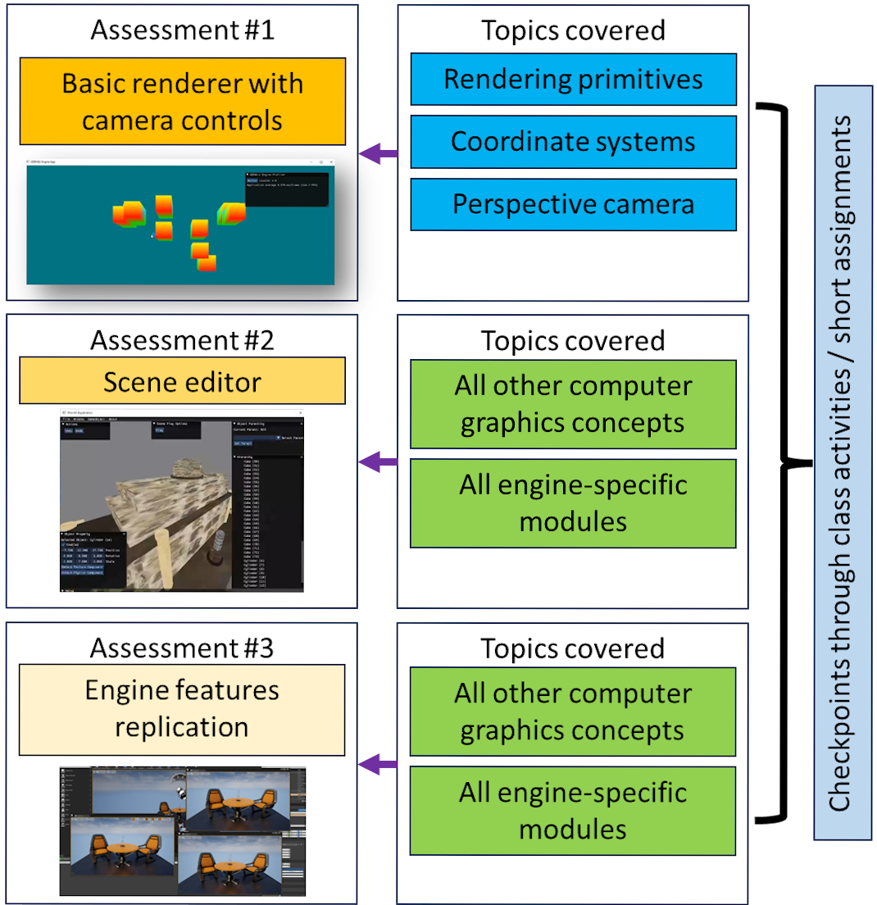
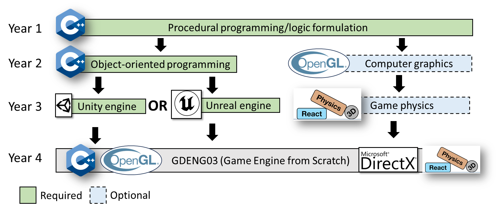

# <center> Constructing a game engine: A proposed game engine architecture course for undergraduate students
### <center>In Entertainment Computing - Elsevier
### <center>Neil Patrick Del Gallego</center>
### <center>Graphics, Animation, Multimedia, and Entertainment (GAME) Lab - De La Salle University, Philippines</center>

<center></center>

<br>

### <strong> <a href = "https://www.sciencedirect.com/science/article/pii/S1875952124000259?fbclid=IwAR1KTh-0BHUjtvKRk2O_vCCyaLjK6HJR56iYjVpdJl7D75hTcJyTnD3rLHY"> Paper </a> | <a href = "https://github.com/NeilDG/GDENG03-Engine">Scene editor source code</a> | Powerpoint slides (coming soon) </strong>
For immediate access to powerpoint slides, please send an email for the request. Please indicate the purpose. Email: neil.delgallego@dlsu.edu.ph

<br>


### Abstract

<p align="justify">This paper presents a structured series of lessons for teaching undergraduate computer science or game development students how to construct a game engine using C++ and standard graphics APIs such as OpenGL or DirectX. Our proposed course content discusses rendering topics, game object management, scene management, and rigid body physics where learners are tasked to incorporate them into a fully functional prototype scene editor. By incorporating actual coding into the course, students can gain a better understanding of low-level engine features and also hone their programming skills. In addition to the learning content, we provide recommended assessment methods. We include discussions about our teaching experience in handling a game engine architecture course, titled GDENG03, \hl{which 36 students have passed}. Our paper stands out from related works by providing a framework for interested educators on how to write a 3D game engine and how to teach the same in class. Based on our actual delivery of GDENG03, all 36 students achieved high scores of $>80\%$ out of 100 which demonstrates the effectiveness of our learning content. We received positive student feedback, such as a better appreciation of game engines, while suggestions for course improvement were raised, such as using simpler terminologies and better workload management. Based on student scores and feedback, we can attribute the success of our students' learning to our inclusion of practical coding examples and discussions, highlighting their relevance to mainstream game engines. </p>
### Citation
Coming soon

<!--```
@article{DELGALLEGO2022108631,
        title = {A new approach for training a physics-based dehazing network using synthetic images},
        journal = {Signal Processing},
        volume = {199},
        pages = {108631},
        year = {2022},
        issn = {0165-1684},
        doi = {https://doi.org/10.1016/j.sigpro.2022.108631},
        url = {https://www.sciencedirect.com/science/article/pii/S0165168422001712},
        author = {Neil Patrick {Del Gallego} and Joel Ilao and Macario Cordel and Conrado Ruiz}
}
```-->

### Acknowledgements
We would like to acknowledge De La Salle University (DLSU) and DLSU Science Foundation for funding this research. The authors would like to give thanks to the DLSU students for giving valuable feedback about the course.